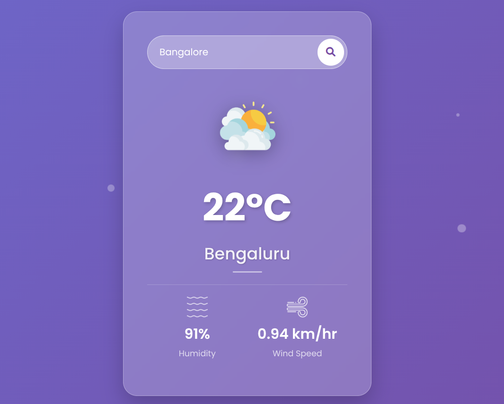

# 🌦️ Weather App using JavaScript

A simple and intuitive weather application built using **HTML**, **CSS**, and **JavaScript**. This app fetches real-time weather data using the [OpenWeatherMap API](https://openweathermap.org/api) and displays it in a user-friendly interface.

## 🔥 Demo



## 🚀 Features

- 🌍 Get current weather data for any city.
- 🔍 Search functionality for cities worldwide.
- 📊 Displays temperature, humidity, wind speed, and weather condition.
- 🎨 Clean and responsive UI.
- 🌐 Uses OpenWeatherMap API for live weather data.

---

## 🛠️ Tech Stack

- **Frontend**: HTML5, CSS3, JavaScript (Vanilla)
- **API**: OpenWeatherMap API

---

## 🧰 Getting Started

### Prerequisites

- A modern web browser (Chrome, Firefox, Edge, etc.)
- Internet connection (to fetch live weather data)
- An API key from [OpenWeatherMap](https://openweathermap.org/api)

### Installation

1. Clone the repository:

```bash
git clone https://github.com/ayushhCreator/weather-app-using-javascript.git

2.Navigate to the project folder:
```bash
  cd weather-app-using-javascript

3.Open index.html in your browser:
```bash
   start index.html

4.Replace YOUR_API_KEY in script.js with your own API key from OpenWeatherMap.


